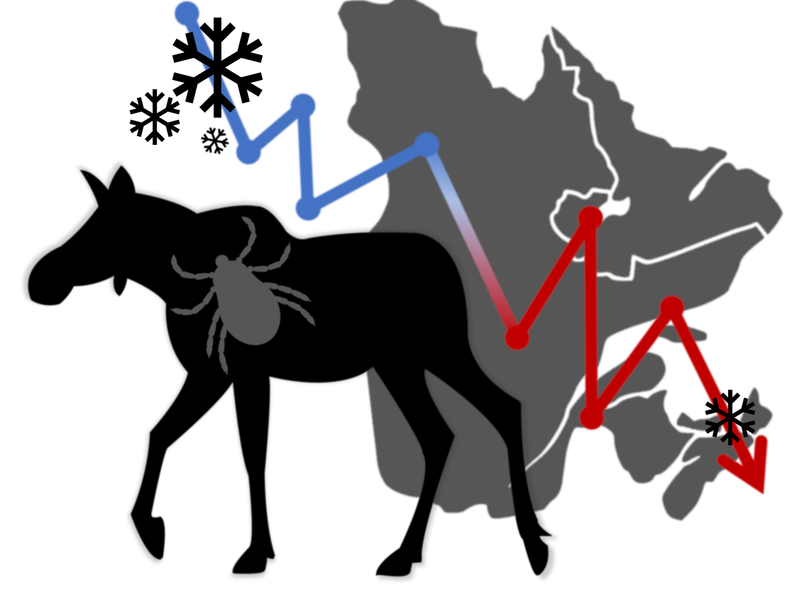
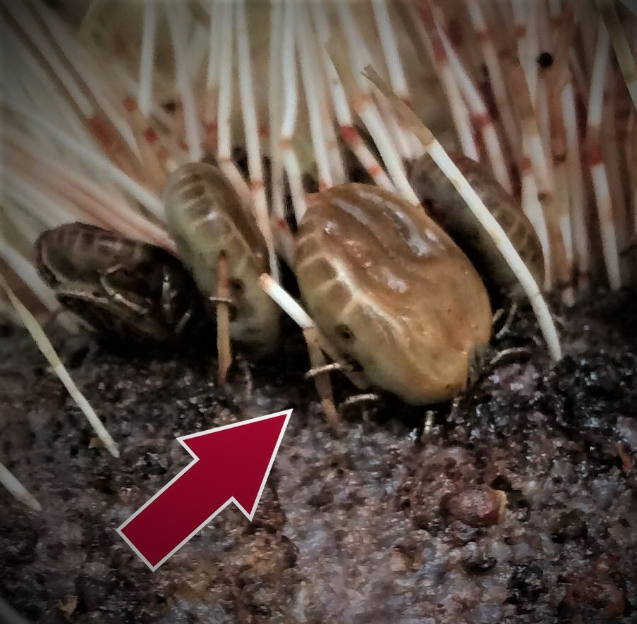

```{r setup, include=FALSE}
htmltools::tagList(rmarkdown::html_dependency_font_awesome())
```

\

<div class="container">

<div class="column-left" style="width:45%;"> 
<div class="tagline" style="text-align:center"> 

\
\

**À l'affût !<br>Traquez les orignaux<br>& la tique d'hiver** 

</div><!-- tagline column closed-->
</div><!-- left column closed-->

<div class="column-center"> </div><!-- center column closed-->

<div class="column-right" style="width:55%;"> 

</div> <!-- right column closed-->

</div><!-- container closed-->

<p style="font-size:10px" align="middle"> \*Phase Pilote - ce protocole sera adapté et disponible à l'ensemble de la population suivant son utilisation en 2020. </p>

\

<p style="font-size:calc(10px + 1.1vw); line-height:1.05;" align="middle"> **Nous avons besoin de vos observations d'orignaux!** <br>elles nous permettent d'obtenir des informations à fine échelle sur les populations d'orignaux. </p>

___

<div class="container">
<div class="column-left"> 
<p style="font-size:calc(10px + 1.5vw);" align="middle">**Pour participer**</p>

<p  style="font-size:calc(10px + 0.5vw); line-height:1.05;" align="middle"> Accédez au formulaire sur ce **[site web <i class="fa fa-external-link "> </i> ](https://arcg.is/nKf8n){target="_blank"}** <br> ou en scannant ce code QR <i class="fa fa-arrow-right" style="font-size:calc(10px + 0.7vw)"></i>

Le formulaire est disponible en ligne ou encore via l'app Survey123 disponible sur IOS et Android; pour y arriver suivez les indications une fois que vous aurez cliqué sur le lien ou scanné le code QR.

Au besoin, n'hésitez pas à consultez les [tutoriels](#tutoriels) pour vous guider dans le partage d'observations

</p>

<p style="font-size:calc(10px + 0.5vw); line-height:1.05;" align="left">**Toutes les observations d'orignaux sont pertinentes, même si le pelage ne semble pas être affecté**:

* Observation d'orignal sans photo
* Observation d'orignal avec photo 
* Photos de caméras de surveillance (caméras de chasse; printemps-été seulement)
</p>

</div><!--- left column closed -->

<div class="column-center"> </div><!--- center column closed -->

<div class="column-right" style="text-align:center;"> 

\


\


<figcaption>Tiques d'hiver<br>au stade adulte;<br>® D. De Pierre</figcaption>

</div> <!--- right column closed -->

</div> <!--- container closed -->

**Comment transmettre le formulaire**: Assurez-vous d'envoyer vos observations *lorsque vous avez accès à un réseau wifi ou cellulaire (3G) stable*. Autrement, les informations sont stockées (emprisonnées) sur votre téléphone et ne nous sont pas envoyées. Merci de votre collaboration!


___

# Contexte

<div class="justtext">
<p style="font-size:calc(10px + 0.2vw); line-height:1.05;" align="middle">
Ailleurs dans le Nord de l'Amérique, la tique d'hiver est associée à des déclins de population importantes, et c'est pourquoi nous sollicitons votre aide en tant que chasseur.euse, pêcheur.euse, professionel.le ou randonneur.euse. À titre d’observateur.trice, votre contribution est précieuse pour l'acquisition de données qui nous aideront à comprendre l'effet de la tique sur la dynamique de population des orignaux sur votre territoire. 

Votre mission, si vous l'acceptez, est de nous partager vos observations d'orignaux, qu'ils soient infestés ou non par la tique d'hiver.

Ce programme de science collaborative s'inscrit dans les axes de recherche du Partenariat de recherche sur les relations tique-orignal-climat. Ce partenariat vise à comprendre et prédire la dynamique des interactions entre la tique d’hiver et les populations d’orignaux de l’est du Canada en fonction des conditions climatiques actuelles et anticipées.

Nous en sommes à la phase pilote; vos suggestions, commentaires, appréciations et questions sont les bienvenues à l'adresse courriel suivante : [toc@bio.ulaval.ca](mailto:toc@bio.ulaval.ca). 
Le développement du programme de science collaborative est dirigé par une équipe de recherche basée à l'Université Laval.

</p>

</div>

\

# Tutoriels

<p style="font-size:10px" align="left"> \*Ces tutoriels peuvent légèrement différer de ce que l'observateur expérimente sur le formulaire si ce dernier a été ajusté récemment. </p>

<p style="font-size:calc(10px + 0.5vw); line-height:1.05;" align="center">
* Comment soumettre une observation d'orignal: 

<iframe width="220" height="315"
src="https://www.youtube.com/embed/NnQsIbl3NTY">
</iframe> 

* Soumettre des photos de caméra de surveillance (printemps): 

<iframe width="100%" height="315"
src="https://www.youtube.com/embed/0ofBROTzwos">
</iframe> 

</p>

\
<!--- **[<i class="fa fa-external-link "> </i>](http://www.sites.google.com/view/tiqueorignalclimat){target="_blank"}** -->

# Information

Pour de plus de détails sur le partenariat de recherche sur les relations tique-orignal-climat, les objectifs, axes de recherche et chercheurs impliqués, un site web sera bien tôt disponible concernant le projet complet, et diffusé ici notamment.

<!--- **[rendez-vous ici <i class="fa fa-external-link " ></i>](http://www.sites.google.com/view/tiqueorignalclimat){target="_blank"}.** -->

\

# Contactez-nous

<i class="fa fa-user-o" ></i> Responsable du projet de science collaborative : Florent Déry

<i class="fa fa-user-circle" ></i> Superviseur du partenariat de recherche TOC : Jean-Pierre Tremblay , professeur titulaire

<i class="glyphicon glyphicon-envelope"> </i> toc@bio.ulaval.ca

<i class="fa fa-address-card"> </i> Département de biologie, Université Laval
1045 av. de la médecine, Québec (Qc), G1V 0A6

\

# Partenaires

\

<div class="container">
  
</div>

